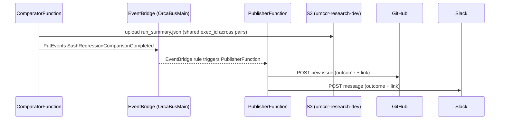
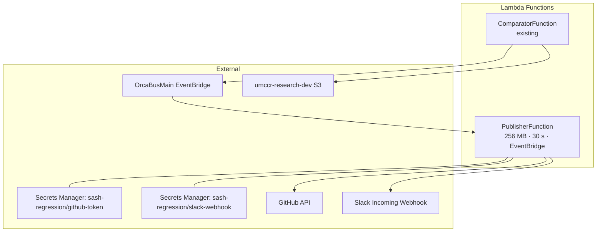

# Design Document: Sash Regression Service — Phase 3 (Publisher)

## Overview

`service-sash-regression` validates `sash` bioinformatics pipeline releases by running known test
cases against both the new version and a curated baseline, then comparing outputs (VCFs, TSVs,
Purple metrics, BCFtools stats) to detect regressions before a release reaches production. Three
Lambda functions are deployed to BETA — Submitter, Watcher, Comparator — but nothing tells anyone
a comparison finished. Operators have to poll CloudWatch or S3 manually.

**Scope of this phase** (per `Daily/2026-07-11.md`, ~3-4 days): the Comparator emits a completion
event, and a new **Publisher Lambda** posts the result to **GitHub and Slack**.

**Explicitly out of scope for this phase** — tracked separately, not designed here:

- Per-pair fan-out (`PairComparatorFunction` + `AggregatorFunction`) — today's test suite is a
  single pair (SEQC-II-medium); fan-out for ~10 pairs has no driving requirement yet and was
  never scoped with Florian. Revisit as its own phase if/when the test suite grows.
- The 3,680-line `comprehensive_sash_comparison.py` module refactor.
- Security hardening (token TTL, `secrets.token_hex`, S3 path-traversal fix, WRU error-body
  checks) — real bugs, but unrelated to "Publisher" scope; filed as an independent fix.

---

## Architecture

### End-to-End Event Flow



### Component Map



---

## Data Models

### `SashRegressionComparisonCompleted` (new)

Base fields per the agreed Obsidian plan (`Daily/2026-07-11.md`), extended with per-status
counts and critical items so the Publisher can build a richer Slack/GitHub message
without a second S3 read.

```typescript
// source: "sash-regression.comparator"
// detailType: "SashRegressionComparisonCompleted"
interface SashRegressionComparisonCompletedDetail {
  newVersion: string; // e.g. "0.7.0"
  baselineVersion: string; // e.g. "0.6.4"
  portalRunId: string; // ties back to the sash run that triggered this comparison
  outcome: 'PASS' | 'FAIL' | 'MANUAL_CHECK';
  resultS3Prefix: string; // s3://umccr-research-dev/sash-regression/<new>-vs-<baseline>/<execId>/
  metricSummary: {
    totalPairs: number;
    passCount: number;
    failCount: number;
    manualCheckCount: number;
    criticalItems: string[]; // up to 8 items
  };
}
```

Field-name note: this supersedes both the `.kiro` rewrite's `status`/`jobId`/`criticalItems`-only
shape and the earlier superpowers draft's `status`/`resultS3Uri` shape — `outcome` and
`portalRunId` are non-negotiable per the Obsidian plan; `metricSummary.*` is the extension.

**2026-08-07 — `WARN` removed.** This design originally carried a four-outcome enum with
`warnCount` and `warningItems`. The Comparator's threshold policy changed after the design was
written: there is no longer a tolerance band, so any real difference is a `FAIL`. The Comparator
can no longer emit `WARN` and no longer produces `warning_count`/`warning_items`, so the enum and
those two `metricSummary` fields are gone from this contract. Rationale and the code map:
`docs/comparison-thresholds.md`.

### Shared `exec_id` per comparison run (unchanged from prior design)

`exec_id` is generated once in `handler()` and threaded into every `_run_pair` call, so all pairs
from one invocation land under one S3 prefix:
`{RESULT_S3_PREFIX}/{new_version}-vs-{baseline_version}/{exec_id}/`. After all pairs complete, one
aggregate `run_summary.json` is uploaded there — this is `resultS3Prefix` in the event above.

---

## Components and Interfaces

### 1. ComparatorFunction (extended — no rename)

Last step of `handler()`, after all S3 uploads succeed:

```python
def _emit_completed_event(new_version, baseline_version, portal_run_id, run_summary, result_s3_prefix):
    events = boto3.client("events")
    events.put_events(Entries=[{
        "Source": "sash-regression.comparator",
        "DetailType": "SashRegressionComparisonCompleted",
        "Detail": json.dumps({
            "newVersion": new_version,
            "baselineVersion": baseline_version,
            "portalRunId": portal_run_id,
            "outcome": run_summary["status"],
            "resultS3Prefix": result_s3_prefix,
            "metricSummary": {
                "totalPairs": run_summary["total_pairs"],
                "passCount": run_summary["pass_count"],
                "failCount": run_summary["fail_count"],
                "manualCheckCount": run_summary["manual_check_count"],
                "criticalItems": run_summary["critical_items"],
            },
        }),
        "EventBusName": EVENTS_BUS_NAME,
    }])
```

`portal_run_id` is threaded through from the Watcher's invocation payload (already present on
the `WorkflowRunStateChange` event that triggers the Comparator via the Watcher). If `put_events`
raises, results are already durably in S3; only the notification is lost, and the Lambda
invocation shows as failed in CloudWatch (visible, not silent).

New environment variable: `EVENTS_BUS_NAME` (same `EVENT_BUS_NAME` constant already used by the
Submitter).

### 2. PublisherFunction (new)

New app module, structured like the existing `watcher/`:

```
app/publisher/
  __init__.py
  slack.py                          # Slack message building + posting
  github.py                         # GitHub issue building + posting
  lambdas/publisher/handler.py      # EventBridge entrypoint
```

**`handler.py`**:

```python
SLACK_WEBHOOK_SECRET_ID = os.environ["SLACK_WEBHOOK_SECRET_ID"]
GITHUB_TOKEN_SECRET_ID = os.environ["GITHUB_TOKEN_SECRET_ID"]

def handler(event: dict, context) -> None:
    detail = event["detail"]
    post_to_slack(_get_webhook_url(SLACK_WEBHOOK_SECRET_ID), build_slack_message(detail))
    title, body = build_github_issue(detail)
    post_to_github(_get_github_token(GITHUB_TOKEN_SECRET_ID), GITHUB_REPO, title, body)
```

Both posts run independently — a Slack failure must not block the GitHub post or vice versa
(see Error Handling below).

**`slack.py`** (carried over from the approved 2026-07-08 design, field names updated to match
the merged event contract):

```python
STATUS_EMOJI = {"PASS": "✅", "FAIL": "❌", "MANUAL_CHECK": "🔎"}

def build_slack_message(detail: dict) -> dict:
    emoji = STATUS_EMOJI.get(detail["outcome"], "❓")
    m = detail["metricSummary"]
    lines = [
        f"{emoji} *sash regression: {detail['newVersion']} vs {detail['baselineVersion']}* — {detail['outcome']}",
        f"Pairs: {m['passCount']} pass / "
        f"{m['failCount']} fail / {m['manualCheckCount']} manual_check",
    ]
    if m.get("criticalItems"):
        lines.append(f"Critical: {', '.join(m['criticalItems'])}")
    lines.append(f"Results: {_s3_console_url(detail['resultS3Prefix'])}")
    return {"text": "\n".join(lines)}

def post_to_slack(webhook_url: str, message: dict) -> None:
    resp = requests.post(webhook_url, json=message, timeout=10)
    resp.raise_for_status()
```

**`github.py`** (new — the piece missing from both prior designs). Posts a **new GitHub issue**
per comparison run rather than a PR comment — this sidesteps PR lookup entirely: no search, no
"is it still open" race condition, nothing that can fail to find a match. The release branch is
referenced by a direct link built from the naming convention (`release/<version>`), assumed to
always hold — not looked up via the API:

```python
def build_github_issue(detail: dict) -> tuple[str, str]:
    """Returns (title, body) for the GitHub issue."""
    emoji = STATUS_EMOJI.get(detail["outcome"], "❓")
    m = detail["metricSummary"]
    title = f"sash regression: {detail['newVersion']} vs {detail['baselineVersion']} — {detail['outcome']}"
    branch_url = f"https://github.com/umccr/sash/tree/release/{detail['newVersion']}"
    lines = [
        f"{emoji} **{detail['outcome']}** — [`release/{detail['newVersion']}`]({branch_url})",
        f"Pairs: {m['passCount']} pass / {m['failCount']} fail / {m['manualCheckCount']} manual_check",
    ]
    if m.get("criticalItems"):
        lines.append("**Critical:** " + ", ".join(m["criticalItems"]))
    lines.append(f"[Results]({_s3_console_url(detail['resultS3Prefix'])})")
    return title, "\n\n".join(lines)


def post_to_github(token: str, repo: str, title: str, body: str) -> None:
    """
    Creates a new GitHub issue with the given title and body.

    Preconditions:
      - repo is "umccr/sash"
      - token has `repo` scope (issue write)
    Postconditions:
      - POSTs to /repos/{repo}/issues with {"title": title, "body": body}
      - Raises RuntimeError on non-2xx response
    """
```

**Assumption, not verified via API call**: `release/<version>` branch naming holds for every
sash release (verified from git history — 0.6.0, 0.6.1, 0.6.2, 0.6.4, 0.7.0, no exceptions — but
not re-checked at runtime). If a future release ever doesn't use that branch name, the linked URL
in the issue simply 404s; it doesn't block issue creation or block the Publisher.

### GitHub token

New secret `sash-regression/github-token` in Secrets Manager (fine-grained PAT or GitHub App
token, scoped to `umccr/sash` issue write), same lifecycle as `ORCABUS_TOKEN_SECRET_ID` —
created and populated manually post-deploy, referenced by ARN in IAM.

### Slack delivery mechanism (unchanged from the approved 2026-07-08 design)

Incoming webhook URL in Secrets Manager (`SLACK_WEBHOOK_SECRET_ID`), not the `AwsChatBotTopic-alerts`
SNS topic (Chatbot-native-alarm-only, cross-account) and not a bot token (unnecessary scope for
one channel). No webhook exists yet — placeholder secret until provisioned and confirmed before
deploy.

---

## CDK Infrastructure Changes

### New Lambda Construct

`infrastructure/stage/deployment-stack.ts` adds:

```typescript
private createPublisherFunction(mainBus: IEventBus, slackWebhookSecretId: string, githubTokenSecretId: string): void
```

- `DockerImageFunction` with `cmd: ['publisher.lambdas.publisher.handler.handler']`
- Role: `secretsmanager:GetSecretValue` scoped to both the Slack webhook secret ARN and the
  GitHub token secret ARN
- New `Rule`:
  ```typescript
  new Rule(this, 'PublisherRule', {
    eventBus: mainBus,
    eventPattern: {
      source: ['sash-regression.comparator'],
      detailType: ['SashRegressionComparisonCompleted'],
    },
    targets: [new LambdaFunction(publisherFn)],
  });
  ```

### Comparator changes

- Gains `events:PutEvents` on `mainBus.eventBusArn` (same statement already present on the
  Submitter role)
- Gains `EVENTS_BUS_NAME` env var

### Per-Stage Constants

`infrastructure/stage/constants.ts` adds two secret-ID maps, following the existing
`WRU_VALIDATOR_FUNCTION_NAME` per-stage pattern:

```typescript
const SLACK_WEBHOOK_SECRET_ID: Record<StageName, string> = {
  BETA: 'sash-regression/slack-webhook-beta',
  GAMMA: 'sash-regression/slack-webhook-gamma',
  PROD: 'sash-regression/slack-webhook',
};

const GITHUB_TOKEN_SECRET_ID: Record<StageName, string> = {
  BETA: 'sash-regression/github-token',
  GAMMA: 'sash-regression/github-token',
  PROD: 'sash-regression/github-token', // single token, repo-scoped, shared across stages
};

export const getStageConstants = (stage: StageName) => ({
  // ...existing fields...
  slackWebhookSecretId: SLACK_WEBHOOK_SECRET_ID[stage],
  githubTokenSecretId: GITHUB_TOKEN_SECRET_ID[stage],
});
```

---

## Updated Directory Structure

```
app/
├── comparator/
│   ├── lambdas/comparator/handler.py  # EXTENDED — shared exec_id, run_summary.json, event emission
│   └── ...                            # unchanged otherwise
├── publisher/
│   ├── lambdas/publisher/handler.py   # NEW — EventBridge trigger
│   ├── slack.py                       # NEW — Slack formatting + delivery
│   └── github.py                      # NEW — GitHub issue formatting + delivery
├── submitter/                         # unchanged in this phase
├── watcher/                           # unchanged in this phase
└── tests/
    ├── test_comparator_handler.py     # EXTENDED — exec_id sharing, run_summary upload, event emission
    ├── test_publisher_slack.py        # NEW
    └── test_publisher_github.py       # NEW
```

---

## Error Handling

- **`put_events` failure in the Comparator**: let it raise. All S3 writes already completed by
  that point; only the notification is lost, and the failure is visible as a Lambda error.
- **Slack delivery failure in the Publisher**: let it raise, but only after the GitHub post has
  been attempted (or vice versa) — one channel's failure should not silently suppress the other.
  Simplest implementation: wrap each post in try/except, log both outcomes, and re-raise a
  combined error if either failed, so EventBridge's default Lambda-target retry policy still
  applies.
- **GitHub post failure**: same treatment. A missing/expired token surfaces as a Lambda error
  metric. There's no PR-lookup step to fail — issue creation only depends on the token being
  valid and the repo being reachable.

---

## Testing Strategy

- `test_comparator_handler.py`:
  - `exec_id` generated once per `handler()` invocation and shared across all pairs
  - run-level `run_summary.json` uploaded with correct content and S3 key
  - `_emit_completed_event` called with the expected `Detail` (mock `boto3.client("events")`)
- `test_publisher_slack.py`:
  - `build_slack_message` output for each outcome (PASS/FAIL/MANUAL_CHECK), including
    critical item formatting and S3 console URL conversion
  - `post_to_slack` call args (mock `requests.post`)
- `test_publisher_github.py`:
  - `build_github_issue` title/body output for each outcome, including the `release/<version>`
    branch link
  - `post_to_github` call args (mock the GitHub API client), raises on non-2xx response
- `test_publisher_handler.py`:
  - both Slack and GitHub posts attempted even if one raises; combined error surfaced

CDK snapshot tests in `test/stage.test.ts` extended to verify the Publisher Lambda and its
EventBridge rule exist, and `cdk-nag` passes with no new suppressions.

---

## Security Considerations

The `PublisherRole` grants `secretsmanager:GetSecretValue` only on the two specific secret ARNs
(Slack webhook, GitHub token) — not a wildcard on all secrets. No other security-relevant changes
are in scope for this phase; the hardening items identified in the `.kiro` review (token TTL,
`secrets.token_hex`, S3 path-traversal fix, WRU error-body checks) are tracked as an independent
fix, not part of Publisher work.

---

## Dependencies

No new runtime dependencies beyond `requests` (already used by the Watcher/Submitter pattern) —
`POST /repos/{repo}/issues` is a single endpoint call, no GitHub SDK needed.

New Secrets Manager secrets (Slack webhook URL, GitHub token) must be created manually before
deploying the Publisher stack. Placeholder secrets can be used for initial deployment; the
Publisher will simply fail to send (with a logged error) until real values are set.
